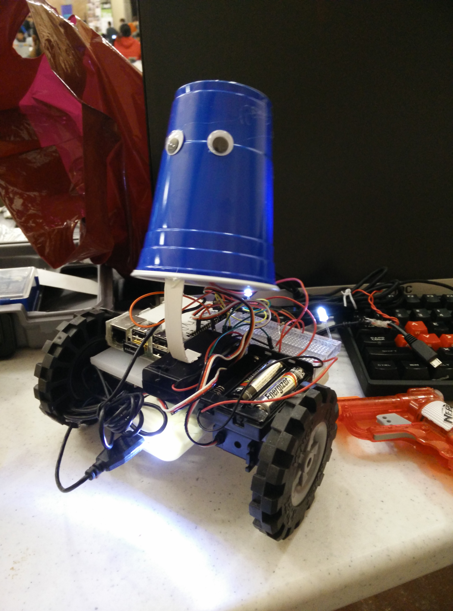
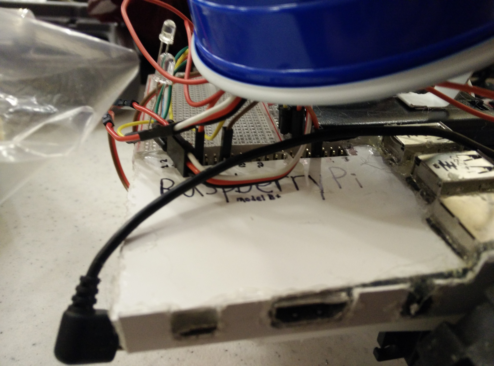
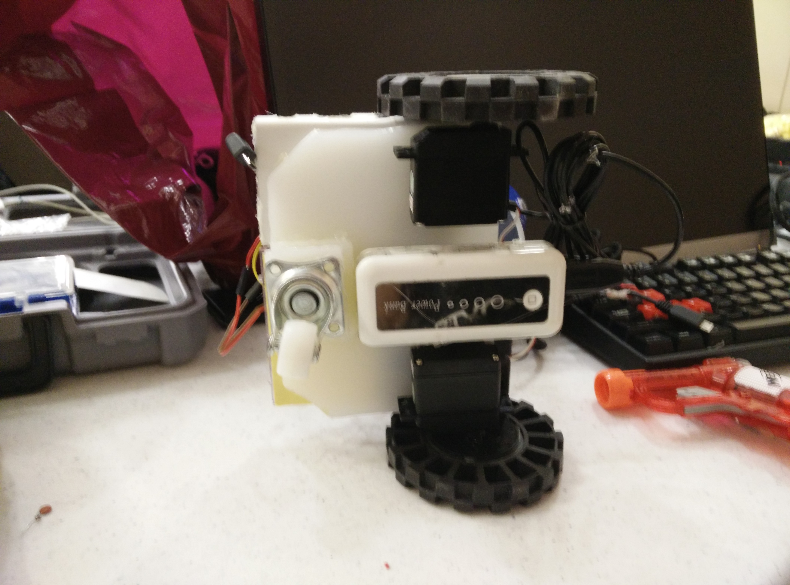
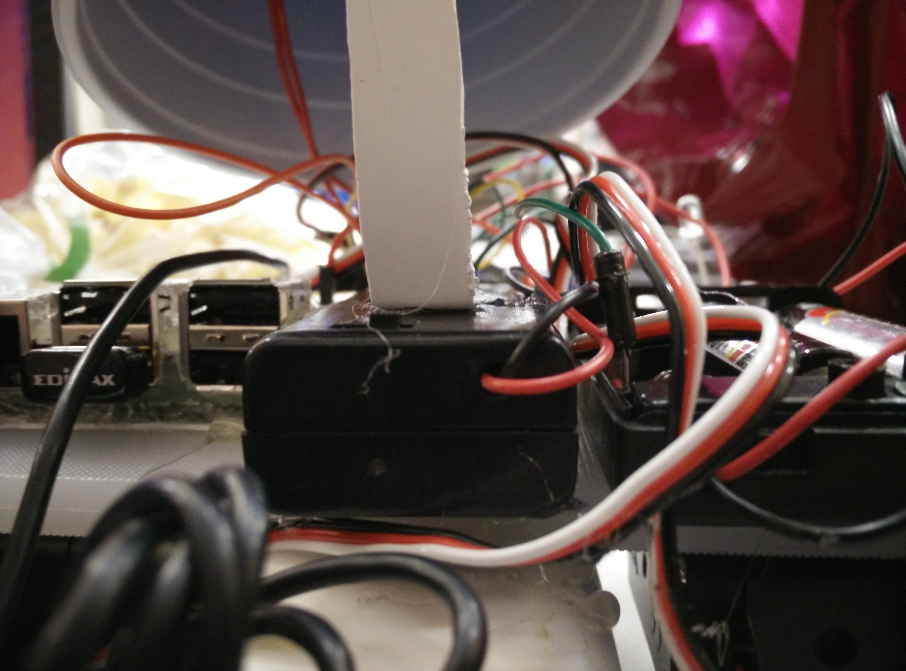
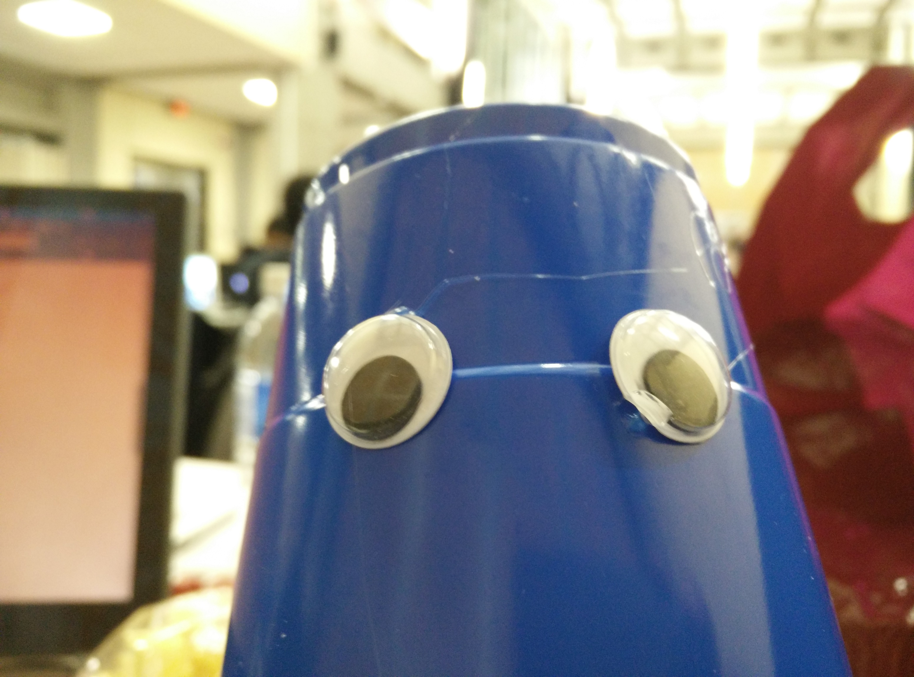

Twitter-Bot 8000
================

Robots. Twitter. Googly eyes.

# [Check out our ChallengePost entry!](http://mchacks15.challengepost.com/submissions/33128-twitter-bot-8000)

Twitter-Bot is a social robot that loves to follow all the latest trends in locomotion, such as "forward", -"backward", "left", and "right"!

Twitter-Bot is made from servos, breadboards, and a Raspberry Pi as the brains of the whole outfit. The Twitter client is written in Python, dipping into the Twitter API using Tweepy.

Just turn it on, then tweet `@BlueberryPii forward` to try it out! Valid commands are `forward`, `backward`, `left`, and `right` (e.g., `@BlueberryPii move forward!`, `go left @BlueberryPii!`.

This repository contains various working files used in the process of creating the robot, plus photos!

Pictures
--------

Run it yourself
---------------

All the scripts run on the Raspberry Pi. In our setup, we ran everything on Raspbain with a Raspberry Pi 1 model B+.

First, make sure you have all the dependencies:

    sudo apt-get install python python-pip
    pip install --upgrade pip # upgrade pip in order to fix a bug when retrieving tweepy (the version in the Raspbain repositories are outdated)
    sudo pip install tweepy

Now we can run the program:

    sudo python TwitterBotAsync.py # needs to be run as root in order to access the Raspberry Pi GPIO
